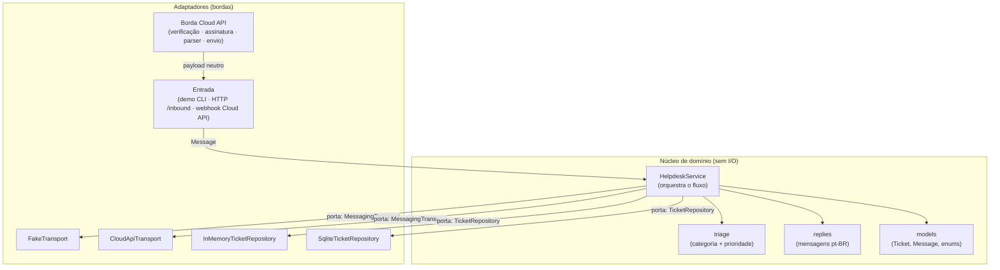
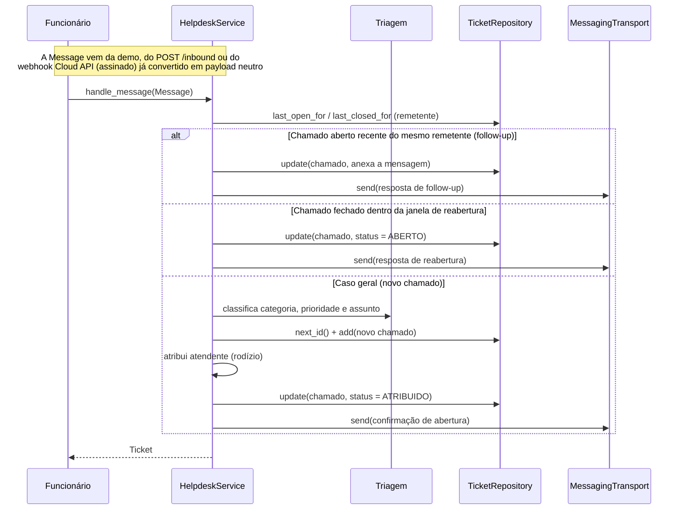
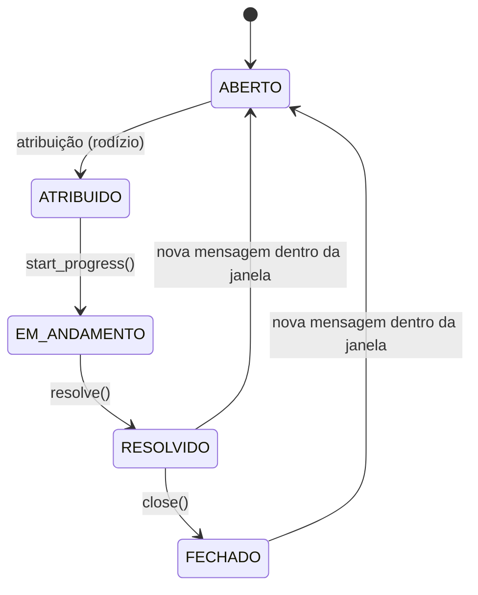

# Arquitetura

Visão técnica de como o sistema está organizado. Resumo: **a regra de negócio
fica isolada no centro e só conversa com interfaces (portas); as integrações
externas entram como adaptadores nas bordas.** É o estilo *ports & adapters*
(hexagonal), escolhido para manter o domínio testável sem WhatsApp real e para
trocar as bordas (mensageria, persistência) sem reescrever a lógica.

## Mapa de componentes

O núcleo depende apenas dos `Protocol` `MessagingTransport` e `TicketRepository`
(as portas). Os adaptadores concretos são plugados de fora, na composição
(`main.py`, `http_app.py` e os testes). O `FakeTransport` é o padrão local; o
`CloudApiTransport` (envio real pela API oficial) entra por `--transport
cloud-api`, e a borda da Cloud API converte o webhook assinado em payload
neutro antes de chegar ao núcleo.

## Fluxo de uma mensagem recebida

A ordem acima reflete `HelpdeskService.handle_message`: follow-up primeiro,
depois reabertura, e por fim a criação. No servidor real, o envio passa por um
`BestEffortTransport`: uma falha de entrega da resposta é registrada em log e
**não** desfaz o chamado já gravado (evita reentrega em laço pela plataforma).

## Ciclo de vida do chamado

`resolve()` e `close()` registram `closed_at`; é esse instante que a janela de
reabertura compara com a chegada de uma nova mensagem do mesmo remetente.

## Responsabilidades por módulo

| Camada | Módulo | Responsabilidade |
|---|---|---|
| Domínio | `helpdesk/models.py` | Entidades e enums; objetos puros, sem I/O |
| Domínio | `helpdesk/triage.py` | Classifica texto em categoria/prioridade e gera o assunto |
| Domínio | `helpdesk/replies.py` | Monta as mensagens automáticas (pt-BR) |
| Orquestração | `helpdesk/service.py` | Follow-up, reabertura, criação, atribuição e resposta |
| Porta | `helpdesk/transport.py` | `MessagingTransport` + `FakeTransport` |
| Porta | `helpdesk/repository.py` | `TicketRepository` + implementações memória/SQLite |
| Borda | `helpdesk/inbound.py` | Payload neutro → `Message`, com idempotência por `event_id` |
| Borda | `helpdesk/whatsapp.py` | Cloud API: verificação do webhook, assinatura HMAC, parser → payload neutro, `CloudApiTransport` (envio, HTTP injetável) |
| Borda | `helpdesk/http_app.py` | Servidor HTTP local (`127.0.0.1`): `/inbound`, painel e rotas `/webhook`; envio melhor-esforço e log operacional |
| Borda | `helpdesk/dashboard.py` | Projeção restrita + página HTML: chamados em aberto, resumos e destaque de idade |
| Configuração | `helpdesk/config.py` | Caminhos e variáveis de ambiente; checagem segura (`config check`) |
| Configuração | `helpdesk/attendants.py` | Carrega e valida o quadro de atendentes (JSON local) |
| Composição | `main.py` | Liga adaptadores ao núcleo (demo CLI) |
| Ferramenta | `helpdesk/demo.py` | Demonstração local: seed fake, simulação de mensagens e pré-voo (`demo check`) |

## Pontos de extensão

Cada borda foi pensada para crescer sem tocar no núcleo:

- **Mensageria:** o `CloudApiTransport` já implementa o envio real pela API
  oficial (ativável por `--transport cloud-api`), ao lado do `FakeTransport` —
  ambos satisfazem `MessagingTransport`, sem mudar o `HelpdeskService`. O
  `BestEffortTransport` envolve o transporte para isolar falhas de envio.
- **Persistência:** `InMemoryTicketRepository` (testes/demo) e
  `SqliteTicketRepository` (persistente) compartilham o mesmo contrato; outras
  implementações entram da mesma forma.
- **Triagem:** hoje por palavras-chave, isolada em `triage.py`. Pode ser trocada
  por outro classificador sem afetar o restante.
- **Entrada:** já há três formas de produzir `Message` — a demo CLI, o
  `POST /inbound` (payload neutro) e o webhook da Cloud API (`/webhook`,
  assinado, convertido em `helpdesk/whatsapp.py`) — todas com o mesmo ponto de
  contato com o núcleo e a mesma idempotência por `event_id`.

## Por que assim

Separar regra de negócio de integração é o que permite **testar tudo de ponta a
ponta sem dependências externas** e adiar decisões de borda (que envolvem
credenciais e produção) sem travar o desenvolvimento. As decisões que levaram a
este desenho estão registradas em [decisões](decisoes.md); o plano por fases
está no [roadmap](roadmap.md).
