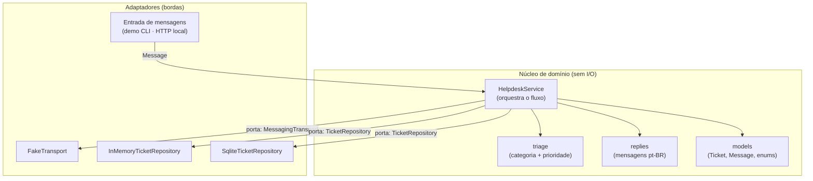
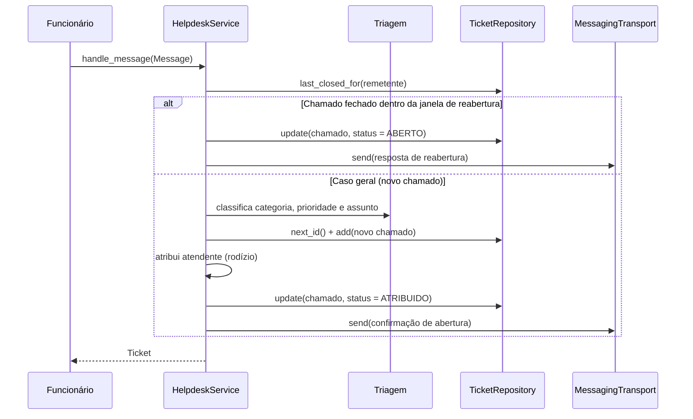
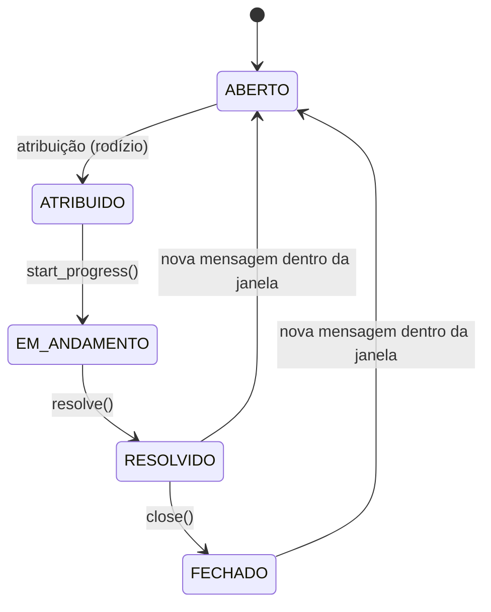

# Arquitetura

Visão técnica de como o sistema está organizado. Resumo: **a regra de negócio
fica isolada no centro e só conversa com interfaces (portas); as integrações
externas entram como adaptadores nas bordas.** É o estilo *ports & adapters*
(hexagonal), escolhido para manter o domínio testável sem WhatsApp real e para
trocar as bordas (mensageria, persistência) sem reescrever a lógica.

## Mapa de componentes

O núcleo depende apenas dos `Protocol` `MessagingTransport` e `TicketRepository`
(as portas). Os adaptadores concretos são plugados de fora, na composição
(`main.py` e os testes).

## Fluxo de uma mensagem recebida

## Ciclo de vida do chamado

`resolve()` e `close()` registram `closed_at`; é esse instante que a janela de
reabertura compara com a chegada de uma nova mensagem do mesmo remetente.

## Responsabilidades por módulo

| Camada | Módulo | Responsabilidade |
|---|---|---|
| Domínio | `helpdesk/models.py` | Entidades e enums; objetos puros, sem I/O |
| Domínio | `helpdesk/triage.py` | Classifica texto em categoria/prioridade e gera o assunto |
| Domínio | `helpdesk/replies.py` | Monta as mensagens automáticas (pt-BR) |
| Orquestração | `helpdesk/service.py` | Follow-up, reabertura, criação, atribuição e resposta |
| Porta | `helpdesk/transport.py` | `MessagingTransport` + `FakeTransport` |
| Porta | `helpdesk/repository.py` | `TicketRepository` + implementações memória/SQLite |
| Borda | `helpdesk/inbound.py` | Payload neutro → `Message`, com idempotência por `event_id` |
| Borda | `helpdesk/http_app.py` | Servidor HTTP local (`127.0.0.1`) da camada de entrada |
| Configuração | `helpdesk/config.py` | Caminhos (banco, quadro de atendentes) via variáveis de ambiente |
| Configuração | `helpdesk/attendants.py` | Carrega e valida o quadro de atendentes (JSON local) |
| Composição | `main.py` | Liga adaptadores ao núcleo (demo CLI) |

## Pontos de extensão

Cada borda foi pensada para crescer sem tocar no núcleo:

- **Mensageria:** uma nova implementação de `MessagingTransport` cobre o envio
  real, sem mudar o `HelpdeskService`.
- **Persistência:** `InMemoryTicketRepository` (testes/demo) e
  `SqliteTicketRepository` (persistente) compartilham o mesmo contrato; outras
  implementações entram da mesma forma.
- **Triagem:** hoje por palavras-chave, isolada em `triage.py`. Pode ser trocada
  por outro classificador sem afetar o restante.
- **Entrada:** a demo injeta `Message` diretamente; uma camada de entrada futura
  produzirá `Message` a partir de outra fonte, mantendo o mesmo ponto de contato.

## Por que assim

Separar regra de negócio de integração é o que permite **testar tudo de ponta a
ponta sem dependências externas** e adiar decisões de borda (que envolvem
credenciais e produção) sem travar o desenvolvimento. As decisões que levaram a
este desenho estão registradas em [decisões](decisoes.md); o plano por fases
está no [roadmap](roadmap.md).
