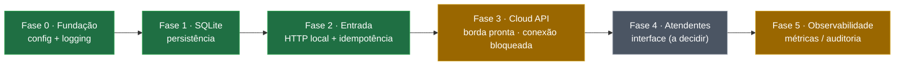
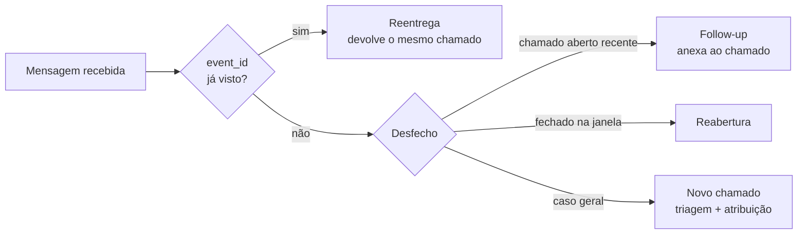

# Mapa do projeto

Visão de uma tela: as **fases** do roadmap e as **decisões** agrupadas por tema.
Pensado como ponto de partida para navegar a documentação — cada item aponta
para a nota detalhada.

> Nota de cofre (Obsidian): este é um *Map of Content* (MOC). Os diagramas são
> **Mermaid**, que renderiza tanto no Obsidian quanto no GitHub — por isso o
> mapa fica versionado e visível nos dois lugares (ao contrário de um canvas,
> que não vai para o repositório).

## Fases (roadmap)

Legenda: **verde** = feito · **amarelo** = parcial · **cinza** = bloqueado por
decisão sua. O que trava as Fases 3 e 4 são decisões de negócio (estratégia do
número; formato da interface dos atendentes), não código. Critérios completos em
[roadmap](roadmap.md).

## Decisões por tema

Atalho para o [registro de decisões](decisoes.md) (ADR), agrupado por assunto:

| Tema | Decisões |
|---|---|
| Arquitetura & fundação | 1 (projeto próprio), 2 (transporte plugável), 4 (repo em memória) |
| Persistência | 5 (SQLite), 13 (threads + SQLite serializado), 16 (timestamp/reset) |
| Triagem | 3 (palavras-chave), 6 (empréstimo de equipamento) |
| Entrada & resiliência | 7 (idempotência), 9 (follow-up), 15 (best-effort + log), 20 (desfecho/observabilidade) |
| Atendentes | 10 (papéis genéricos), 11 (quadro JSON configurável) |
| Atendimento (local/modo) | 18 (presencial/remoto + local) |
| Painel / wallboard | 8 (direção do wallboard), 12 (painel read-only), 17 (leitura rápida) |
| Integração WhatsApp | 14 (borda Cloud API) · risco em [banimento](riscos-banimento.md) |
| Demonstração | 19 (comando `clear`) |

## Fluxo de uma mensagem (resumo)

Detalhe (diagramas de sequência e ciclo de vida) em [arquitetura](arquitetura.md);
o desfecho explícito é a decisão 20.

## Atalhos

- [Arquitetura](arquitetura.md) — componentes, fluxo e ciclo de vida (diagramas).
- [Roadmap](roadmap.md) — fases e decisões em aberto.
- [Registro de decisões](decisoes.md) — ADR completo.
- [Risco de banimento no WhatsApp](riscos-banimento.md) — por que o uso é de baixo risco.
- [Checklist de pré-integração](pre-integracao.md) — antes de conectar uma linha real.
- [Demonstração local](demo-local.md) · [Roteiro de demonstração](roteiro-demo.md)
- [Índice](index.md) — lista de documentos + mapa do código.
